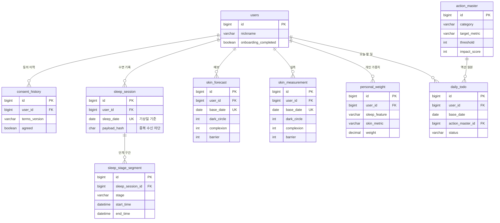

# ERD

테이블 **9개**. 컬럼 하나하나의 근거와 **일부러 넣지 않은 것**을 함께 남긴다.
제품 요구사항은 [prd.md](prd.md), 구조 설계는 [architecture.md](architecture.md), 코드 규칙은 [conventions.md](conventions.md) 참조.

> 스키마는 `ddl-auto: update`로 엔티티에서 생성한다. DDL 스크립트를 따로 두지 않는다.

---

## 1. 관계도

> **PK·FK·유니크 키와 특징적인 컬럼만 표시한다.** 전체 컬럼은 §3 참조. `UK` 표기는 대부분 복합 유니크의 축약이다 (예: `sleep_date UK` → 실제로는 `(user_id, sleep_date)`).



**`skin_forecast`와 `skin_measurement`는 FK로 연결되지 않는다.** `(user_id, base_date)`가 같으면 같은 날의 예보와 실측이다. 검증(HOME-07)은 이 두 행을 조인해 대조한다.

---

## 2. 설계를 관통한 원칙 4가지

이 원칙들이 아래 모든 판단의 근거다. **컬럼을 추가하고 싶어질 때 여기를 먼저 본다.**

### ① 파생값은 컬럼으로 두지 않는다

계산으로 나오는 값을 저장하면, 갱신을 한 번 빠뜨리는 순간 실제 데이터와 어긋난다. 그리고 어긋난 걸 아무도 눈치채지 못한다.

| 넣고 싶어지는 것 | 실제 출처 |
|---|---|
| 검증 누적 일수 (MY-01) | `COUNT(skin_measurement)` |
| 모델 신뢰도 등급 (MY-01) | 누적 일수 → 등급 매핑 |
| 연속 검증일수 (HOME-09) | `skin_measurement.base_date` 연속성 |
| 예보 적중률 (HOME-07, REP-06/08) | 예보 vs 실측 조인 후 계산 |
| 지표 등급 라벨 (HOME-03) | 점수 → 컷오프 매핑 |
| 판정 라벨 (HOME-07) | 오차 → 구간 매핑 |
| TODO 달성률 (TODO-05) | `COUNT(status='DONE') / COUNT(*)` |
| 마지막 동기화 시각 (MY-02) | `MAX(sleep_session.created_at)` |
| HealthKit 연결 상태 (MY-02) | **서버가 알 수 없다** — 클라이언트 권한 상태 |

**등급·판정을 저장하지 않는 이유는 하나 더 있다.** 컷오프([prd.md](prd.md) §10.1)나 오차 구간(§10.2)을 조정했을 때, 저장해뒀으면 과거 데이터만 옛 기준으로 남는다. 같은 78점이 어제는 "좋음" 오늘은 "보통"으로 보인다. 점수를 원본으로 두고 계산하면 기준 변경이 전체에 일관되게 반영된다.

### ② 확정된 것은 컬럼, 바뀔 것은 행

| | 개수 | 변경 가능성 | 저장 형태 |
|---|---|---|---|
| 피부 지표 | 3종 **확정** | 없음 | **컬럼** (`skin_forecast`) |
| 피처×지표 매핑 | 7쌍 **임시** ([prd.md](prd.md) §9.1) | 팀 논의로 재확정 예정 | **행** (`personal_weight`) |

지표를 행으로 나누면 검증할 때마다 예보 3행 × 실측 3행을 조인해야 한다. 반대로 가중치를 컬럼으로 펴면 매핑이 바뀔 때마다 `ALTER TABLE`을 해야 한다.

> 2026-08-06에 매핑이 5쌍 → 7쌍이 됐다(`REM_SLEEP`·`RESTING_HEART_RATE` 승격). **스키마는 그대로였다** — 이 원칙이 실제로 값을 한 셈이다.

### ③ 백필이 정확하면 지금 넣지 않는다

**"나중에 필요할지도 모르니 컬럼으로 미리 열어두자"를 하지 않는다.** 판단 기준은 하나다 — **나중에 추가할 때 기존 행을 정확한 값으로 채울 수 있는가.**

| 뺀 것 | 되살릴 시점 | 백필 |
|---|---|---|
| `daily_todo.source` | TODO-06(사용자 추가) 착수 시 | `DEFAULT 'RECOMMENDED'` — 그전 행은 **전부 추천이므로 실제로 맞다** ✅ |
| `action_master.category`의 `NIGHT_CHECK` | (기능 자체가 제외됨) | — |

`source`는 TODO-06 전까지 값이 하나뿐인 **상수 컬럼**이고, 나중에 넣어도 데이터를 잃지 않는다. 이 초안에는 "결정을 미루려고" 열어둔 컬럼이 둘 있었는데 **둘 다 결국 제거됐다.** 미리 연 컬럼은 쓰이지 않는 동안 계속 "이건 왜 있지"를 유발한다.

반대로 **백필이 불가능한 것은 지금 넣어야 한다.** `daily_todo.completed_at`이 그 경계선이었다 — 과거 체크 시각은 복원할 수 없다. 그래서 뺄 때 "`updated_at`이 대신한다"는 별도 근거가 필요했다(§3.9).

### ④ 유니크 제약은 장식이 아니라 정확성 장치다

⚠️ **아래 5개는 반드시 실제로 걸렸는지 확인한다.** `ddl-auto: update`는 새 테이블을 만들 때 제약을 함께 만들지만, 기존 테이블에 제약을 추가하는 것은 보장되지 않는다.

| 테이블 | 제약 | 지키는 것 |
|---|---|---|
| `sleep_session` | `(user_id, sleep_date)` | **같은 수면 데이터 재처리 차단**의 마지막 방어선 |
| `skin_forecast` | `(user_id, base_date)` | 하루 1건 — 검증 대조의 단일 기준 |
| `skin_measurement` | `(user_id, base_date)` | 하루 1회 검증 |
| `personal_weight` | `(user_id, sleep_feature, skin_metric)` | 가중치 중복 학습 차단 |
| `daily_todo` | `(user_id, base_date, action_master_id)` | 같은 항목 중복 추가 차단 |

```sql
SHOW CREATE TABLE sleep_session;
```

제약이 빠지면 중복 차단이 애플리케이션 코드에만 의존하게 되고, **동시 요청에서 조용히 뚫린다.**

---

## 3. 테이블 상세

### 3.1 `users` — 사용자

| 컬럼 | 타입 | 제약 | 비고 |
|---|---|---|---|
| `id` | BIGINT | PK, AUTO_INCREMENT | |
| `nickname` | VARCHAR(50) | NOT NULL | MY-01 프로필 |
| `onboarding_completed` | BOOLEAN | NOT NULL, DEFAULT false | ONB-05 |
| `created_at` | DATETIME(6) | NOT NULL | `BaseTimeEntity` |
| `updated_at` | DATETIME(6) | NOT NULL | |

인증이 없으므로 `email`·`password`·`provider_id`가 없다. 테스트 유저를 DB에 직접 주입한다.

**빼기로 한 것**

| 컬럼 | 이유 |
|---|---|
| `profile_image_url` | 업로드 기능이 없다. 데모 사용자는 클라이언트 기본 이미지로 충분 |
| `time_zone` | **앱이 요청에 `baseDate`를 실어 보낸다.** 서버가 "오늘"을 정할 필요가 없다 |
| `deleted_at` | MY-04는 **복구 불가 영구 삭제**다. soft delete가 아니다 |

`time_zone`을 뺀 대신 **모든 조회 API가 기준일을 파라미터로 받는다.** 서버 시각이 UTC여도 날짜가 어긋나지 않는다.

### 3.2 `consent_history` — 동의 이력

| 컬럼 | 타입 | 제약 | 비고 |
|---|---|---|---|
| `id` | BIGINT | PK, AUTO_INCREMENT | |
| `user_id` | BIGINT | NOT NULL, FK → `users.id` CASCADE | |
| `terms_version` | VARCHAR(20) | NOT NULL | 예: `"1.0"` |
| `agreed` | BOOLEAN | NOT NULL | |
| `created_at` | DATETIME(6) | NOT NULL | **= 동의 시각** |

인덱스: `(user_id, created_at)` — "이 사용자의 가장 최근 동의는?"이 주 조회 패턴.

**`consent_type`이 없다.** 동의 항목을 **필수 하나(개인정보 수집·이용, ONB-02)로 고정**했다. 값이 하나뿐인 구분 컬럼은 분기도 조회 조건도 만들지 못한다. 선택 동의(마케팅 수신 등)가 추가되면 그때 넣는다.

**`updated_at`이 없다.** append-only 이력이라 수정하지 않는다. 약관이 개정되면 UPDATE가 아니라 **새 행을 INSERT**한다. 그래야 "언제 어느 버전에 동의했는가"가 남는다. → `BaseCreatedEntity` 상속.

**`terms_version`이 이 테이블의 존재 이유다.** 이것까지 빼면 남는 정보가 "행이 있다 = 동의했다"뿐이라 `users.consent_agreed_at` 컬럼 하나로 대체된다. 재동의 판정을 `WHERE terms_version <> ?` 한 줄로 끝내기 위해 테이블로 유지한다. ([prd.md](prd.md) §7 P4에서 원문·버전이 확정되면 상수로 고정)

**`agreed_at`을 따로 두지 않았다.** 행이 생기는 순간이 곧 동의하는 순간이라 `created_at`과 값이 항상 같다. 같은 값을 가진 컬럼이 둘이면 나중에 어긋날 때 어느 쪽이 맞는지 알 수 없다.

**약관 원문 테이블을 만들지 않는다.** MY-05가 약관을 정적 리소스 + 외부 링크로 제공한다. 여기엔 버전 문자열만 기록한다.

> `agreed`는 현재 정책("미동의 = 계정 미생성")상 항상 `true`다. 그럼에도 남겨둔 것은 [prd.md](prd.md) §7 P1("미동의 = 앱 종료"의 스토어 심사 리스크)이 검토 중이기 때문이다. 정책이 바뀌면 `false` 행이 생긴다.

### 3.3 `sleep_session` — 수면 세션

| 컬럼 | 타입 | 제약 | 비고 |
|---|---|---|---|
| `id` | BIGINT | PK, AUTO_INCREMENT | |
| `user_id` | BIGINT | NOT NULL, FK → `users.id` CASCADE | |
| `sleep_date` | DATE | NOT NULL | **기상일 기준** — 아래 참조 |
| `sleep_onset_time` | DATETIME(6) | NOT NULL | **잠든 시각** — 첫 `asleep` 시작. 취침 규칙성의 기준 |
| `wake_time` | DATETIME(6) | NOT NULL | 기상 시각 |
| `total_sleep_minutes` | INT | NOT NULL | REP-04 |
| `deep_sleep_minutes` | INT | NOT NULL | 장벽 지표 핵심 |
| `rem_sleep_minutes` | INT | NOT NULL | |
| `core_sleep_minutes` | INT | NOT NULL | 얕은 수면 (HealthKit `asleepCore`) |
| `awake_count` | INT | NOT NULL | **다크서클 예측 핵심 변수** — 5분 이상 각성만 |
| `awake_minutes` | INT | NOT NULL | 각성 총 시간 — 5분 이상 각성 구간의 합 |
| `hrv` | DECIMAL(6,2) | NULL | ms |
| `resting_heart_rate` | INT | NULL | bpm |
| `payload_hash` | CHAR(64) | NOT NULL | SHA-256 hex |
| `created_at` | DATETIME(6) | NOT NULL | |
| `updated_at` | DATETIME(6) | NOT NULL | 재수신 갱신 시 변경 |

**UNIQUE `(user_id, sleep_date)`**

**`sleep_date`는 기상일 기준이다.** `23:40 잠듦 → 07:10 기상`이면 07:10의 날짜다. 이래야 `skin_forecast.base_date`와 **같은 값**이 되어 변환 없이 조인된다. 취침일 기준으로 잡으면 모든 조인에 `+1일` 보정이 붙고, 언젠가 한 군데를 빠뜨린다.

> 화면 표현은 그대로 "어젯밤 수면"이다. 저장 기준만 기상일일 뿐이다.

**`payload_hash`가 중복 수신을 막는다.** 앱은 시작될 때마다 업로드하므로 새 수면 데이터가 생기기 전까지 같은 세션이 계속 온다. 정규화 후 해시를 비교해 **저장·스코어링을 시작하기 전에 중단**한다. 자세한 규칙은 [prd.md](prd.md) §5.1.

**`hrv`·`resting_heart_rate`만 NULL을 허용한다.** 워치를 차지 않고 잔 밤이 있다. 나머지 단계 값은 세션이 존재하는 이상 0이라도 들어온다.

> **이 두 컬럼은 스코어링 피처이기도 하다**(`HRV`·`RESTING_HEART_RATE` → `COMPLEXION`). 즉 **결측되는 피처가 존재한다.** 둘은 같은 워치 착용 여부에 의존해 **함께 결측되므로**, 그 밤의 `COMPLEXION`은 피처 3개 중 1개만 남는다. 처리 방식은 미정 — [prd.md](prd.md) §7 **B7**.

**`total_sleep_minutes`는 저장한다.** `deep + rem + core`로 구할 수 있어 보이지만, HealthKit에 `asleepUnspecified`(단계 미상) 구간이 있어 **셋의 합이 총 수면 시간보다 적을 수 있다.** 앱이 보고한 값을 그대로 둔다.

**시각 컬럼의 기준은 "잠든 시각"이다.** `sleep_onset_time`은 첫 `asleep` 구간의 시작이며, `asleep`이 있어야 수면 세션이므로 **항상 존재한다.** 취침 규칙성(§9.1 → `COMPLEXION`)은 이 값으로만 계산한다.

```
00:05 잠듦 ──────────── 07:10 기상
sleep_onset_time        wake_time
```

**"누운 시각"은 저장하지 않는다.** 이름을 `bed_time`이 아니라 `sleep_onset_time`으로 둔 이유이기도 하다. 누운 시각은 HealthKit `inBed` 샘플에서만 나오는데, **사용자가 수면 스케줄·수면 집중 모드를 쓰지 않으면 `asleep`만 남는 밤이 생긴다.** 어떤 밤은 누운 시각, 어떤 밤은 잠든 시각이 들어가면 같은 컬럼이 밤마다 다른 것을 가리키고, **규칙적으로 자는 사용자도 편차가 크게 계산되어 혈색 예보만 나빠진다.**

**그래서 `inBed`에서 파생되는 것을 전부 뺐다** — 누운 시각 · 누운 시간 · **입면 지연** · **수면 효율**(`총 수면 / 누운 시간`). 넷 다 같은 원본에 의존해 **함께 결측되므로**, 넣으면 스코어링에 "이 밤은 이 피처가 없다"는 분기가 생긴다. 기존 피처엔 없던 문제이고, 값을 못 믿는 피처를 위해 그 복잡도를 살 이유가 없다. 화면에 보여줄 지표에서도 제외됐다 ([prd.md](prd.md) §3).

> 나중에 필요해지면 `bed_time`·`in_bed_minutes`를 NULL 허용으로 추가하면 된다. 그때는 **결측 밤의 스코어링 처리**(해당 피처 제외 후 재정규화 / 기본값 대입)를 먼저 정해야 한다.

**`awake_count`·`awake_minutes`는 5분 임계값으로 정의된다** (2026-08-06 확정). **5분 이상 지속된 `AWAKE` 구간만** 각성 1회로 세고, 총 시간도 **그 구간들만** 합산한다. 5분 미만은 뒤척임으로 보고 양쪽 모두에서 버린다. 임계값이 없으면 30초짜리 뒤척임까지 1회로 잡혀 사람마다 각성 횟수가 20회씩 나온다.

**두 컬럼에 같은 임계값을 쓴다.** REP-04가 둘을 나란히 보여주기 때문이다. 횟수에만 임계값을 걸면 `awake_count=0` · `awake_minutes=12`처럼 화면에서 모순되는 조합이 나온다.

**마지막 `asleep` 구간 이후의 `AWAKE`는 세지 않는다.** 그건 야간 각성이 아니라 기상이다. 포함하면 모든 사용자가 매일 최소 1회를 깔고 시작해 다크서클 예보가 전반적으로 눌린다.

```
…CORE ─ AWAKE(4분) ─ CORE ─ AWAKE(7분) ─ CORE ─ AWAKE(18분) ─ [기상]
         임계값 미달           1회 · 7분         마지막 asleep 이후 → 기상

awake_count = 1,  awake_minutes = 7
```

**이 값은 서버가 `sleep_stage_segment`에서 계산한다.** 앱이 보낸 각성 횟수를 그대로 받지 않는다. 임계값이 서버 상수로 남아야 앱 배포 없이 바꿀 수 있고, 모든 사용자에게 같은 기준이 적용된다. 상수는 `domain/sleep` 정규화 정책 한 곳에 둔다 (`ScoringPolicy`가 아니다 — 스코어링 파라미터가 아니라 수집 정규화 규칙이다).

> 임계값을 나중에 바꾸면 **이미 저장된 세션은 재계산되지 않는다.** 과거 데이터와 기준이 달라지므로, 바꾼다면 검증 이력이 쌓이기 전에 바꾼다.

### 3.4 `sleep_stage_segment` — 수면 단계 구간

| 컬럼 | 타입 | 제약 | 비고 |
|---|---|---|---|
| `id` | BIGINT | PK, AUTO_INCREMENT | |
| `sleep_session_id` | BIGINT | NOT NULL, FK → `sleep_session.id` CASCADE | |
| `stage` | VARCHAR(20) | NOT NULL | `DEEP` / `REM` / `CORE` / `AWAKE` |
| `start_time` | DATETIME(6) | NOT NULL | |
| `end_time` | DATETIME(6) | NOT NULL | |

인덱스: `(sleep_session_id, start_time)`

**타임스탬프 컬럼이 없다.** 세션에 종속된 상세 데이터고, 세션이 갱신되면 **전량 삭제 후 재삽입**된다. 개별 행의 생성 시각은 의미가 없다.

**`user_id`를 넣지 않았다.** `sleep_session`을 거쳐 가면 된다. 자식 테이블에 부모의 부모 FK를 중복해 두면 둘이 어긋날 수 있다.

**`duration_minutes`를 두지 않았다.** `end_time - start_time`으로 즉시 나오고, **단계별 총량은 이미 `sleep_session`에 집계돼 있다.** 이 테이블은 순수하게 타임라인 렌더링용이다.

> 이 테이블을 쓰는 기능은 REP-03 하나뿐이고 우선순위가 `medium`이다. **핵심 루프 개발에는 관여하지 않으므로 3단계로 미뤄도 된다.**

### 3.5 `skin_forecast` — 피부 예보

| 컬럼 | 타입 | 제약 | 비고 |
|---|---|---|---|
| `id` | BIGINT | PK, AUTO_INCREMENT | |
| `user_id` | BIGINT | NOT NULL, FK → `users.id` CASCADE | |
| `base_date` | DATE | NOT NULL | `sleep_session.sleep_date`와 같은 값 |
| `dark_circle` | INT | NOT NULL, CHECK 0~100 | 다크서클 회복 — **높을수록 맑음** |
| `complexion` | INT | NOT NULL, CHECK 0~100 | 혈색 — **높을수록 생기 있음** |
| `barrier` | INT | NOT NULL, CHECK 0~100 | 장벽 — **높을수록 튼튼함** |
| `created_at` | DATETIME(6) | NOT NULL | |
| `updated_at` | DATETIME(6) | NOT NULL | 재산출 시 변경 |

**UNIQUE `(user_id, base_date)`** — HOME-07 대조의 단일 기준.

**등급 라벨 컬럼이 없다** (원칙 ①).

**`sleep_session_id` FK가 없다.** `base_date`가 곧 `sleep_date`라 `(user_id, base_date)`로 바로 조인된다.

**예보 이력 테이블을 만들지 않는다.** "검증을 마친 날의 예보는 재산출하지 않는다"는 정책 덕분이다. 검증에 쓰인 예보는 절대 바뀌지 않으므로 이력이 필요 없다.

> `CHECK` 제약은 MySQL 8.0.16부터 실제로 동작한다. 그 이전 버전은 문법만 받고 무시한다.

### 3.6 `skin_measurement` — 셀피 실측

| 컬럼 | 타입 | 제약 | 비고 |
|---|---|---|---|
| `id` | BIGINT | PK, AUTO_INCREMENT | |
| `user_id` | BIGINT | NOT NULL, FK → `users.id` CASCADE | |
| `base_date` | DATE | NOT NULL | 예보와 같은 기준일 |
| `dark_circle` | INT | NOT NULL, CHECK 0~100 | LLM 산출값 — 예보와 **같은 방향**(높을수록 맑음) |
| `complexion` | INT | NOT NULL, CHECK 0~100 | 높을수록 생기 있음 |
| `barrier` | INT | NOT NULL, CHECK 0~100 | 높을수록 튼튼함 |
| `analyzed_at` | DATETIME(6) | NOT NULL | 분석 완료 시각 |
| `created_at` | DATETIME(6) | NOT NULL | |

**UNIQUE `(user_id, base_date)`** — 하루 1회 검증.

`skin_forecast`와 컬럼이 거의 같다. **의도한 것이다** — 같은 세트여야 HOME-07 대조가 성립한다.

**점수 방향도 예보와 같아야 한다.** 셋 다 높을수록 좋은 상태다. LLM이 `dark_circle`을 "다크서클이 심한 정도"로 해석하면 값이 뒤집히는데, 범위·타입은 그대로라 `CHECK` 제약도 스키마 검증도 걸리지 않는다. **적중률만 조용히 무너진다.** 프롬프트에서 방향을 명시하는 것이 유일한 방어선이다 → [architecture.md](architecture.md) §OpenAI Vision

### ⚠️ 이미지 경로 컬럼을 두지 않는다 — 앞으로도

셀피 원본을 보관하지 않는다는 정책([prd.md](prd.md) §5.2)을 **구조로 증명하는 가장 강한 장치**다. 참조할 컬럼이 없으면 실수로도 보관할 수 없다.

**"디버깅용으로 잠깐만"이라는 요청이 와도 추가하지 않는다.** 컴파일러도 테스트도 이걸 막아주지 않는다. 코드 리뷰가 유일한 방어선이라 PR 체크리스트에 항목으로 들어가 있다.

**분석 성공/실패 상태 컬럼이 없다.** 실패하면 애초에 행이 안 생긴다. 실패는 `SELFIE_ANALYSIS_FAILED` 에러 응답으로 끝나고 앱이 재시도한다. 항상 `SUCCESS`인 컬럼은 의미가 없다.

**`updated_at`이 없다.** 실측값은 갱신되지 않는다. 셀피를 다시 찍는 건 다시 분석하는 것이고, 하루 1회 제약에 걸린다.

**`analyzed_at`과 `created_at`을 둘 다 뒀다.** `consent_history`에서는 중복이라 합쳤지만 여기는 다르다. **LLM 호출이 최대 30초 걸려** 실제 시차가 있다. 응답 지연 측정에 쓴다.

### 3.7 `personal_weight` — 개인 가중치

| 컬럼 | 타입 | 제약 | 비고 |
|---|---|---|---|
| `id` | BIGINT | PK, AUTO_INCREMENT | |
| `user_id` | BIGINT | NOT NULL, FK → `users.id` CASCADE | |
| `sleep_feature` | VARCHAR(30) | NOT NULL | 아래 7종 |
| `skin_metric` | VARCHAR(20) | NOT NULL | `DARK_CIRCLE` / `COMPLEXION` / `BARRIER` |
| `weight` | DECIMAL(6,4) | NOT NULL | 배수. REP-12 예시 "1.7배 민감" → `1.7000` |
| `created_at` | DATETIME(6) | NOT NULL | |
| `updated_at` | DATETIME(6) | NOT NULL | 학습 시 갱신 |

**UNIQUE `(user_id, sleep_feature, skin_metric)`**

**두 컬럼은 쌍을 이룬다.** 전체 조합(7×3=21)이 아니라 [prd.md](prd.md) §9.1이 인정한 **쌍만** 행이 된다. 사용자 한 명당 **7행** (2026-08-06 기준):

| `sleep_feature` | `skin_metric` |
|---|---|
| `AWAKE_COUNT` | `DARK_CIRCLE` |
| `TOTAL_SLEEP` | `DARK_CIRCLE` |
| `DEEP_SLEEP` | `BARRIER` |
| `REM_SLEEP` | `BARRIER` |
| `BEDTIME_REGULARITY` | `COMPLEXION` |
| `HRV` | `COMPLEXION` |
| `RESTING_HEART_RATE` | `COMPLEXION` |

`AWAKE_MINUTES`(각성 총 시간)는 지표 배정이 미정이라 아직 행이 없다 → §9.1. 배정되면 8행이 된다.

**§9.1이 유일한 출처다.** 이 표는 사본이며, 매핑을 바꿀 땐 §9.1을 고치고 여기와 §4.4 REP-07 표를 맞춘다. 세 곳이 어긋나면 예보·리포트·학습이 서로 다른 근거를 쓰게 된다.

**행으로 편 이유는 매핑이 임시값이기 때문이다** (원칙 ②). 컬럼으로 펴면 매핑이 바뀔 때마다 `ALTER TABLE`을 해야 한다. 실제로 2026-08-06에 `REM_SLEEP`·`RESTING_HEART_RATE`가 추가됐는데 **스키마 변경 없이 행만 늘었다.**

**`누적 검증 횟수` 컬럼이 없다** (원칙 ①). `COUNT(skin_measurement)`로 나온다. MY-01·REP-12·HOME-08이 전부 이 숫자를 쓰므로 어긋나면 세 화면이 동시에 틀린다.

**일반(기본) 가중치 테이블을 만들지 않는다.** 일반 가중치는 §9.1 임시값의 일부이고, 임시값은 전부 `domain/skin/ScoringPolicy`(코드)에 모으기로 했다. 코드에 두면 매핑과 초기 가중치가 한 파일에서 같이 바뀐다.

**행은 첫 검증 때 만든다.** 검증하지 않은 사용자는 행이 0개이고, 예보 산출 시 `ScoringPolicy`의 일반 가중치를 쓴다. **행의 존재 자체가 "개인화가 시작됐다"는 뜻**이 되어 REP-12의 판단이 단순해진다.

### 3.8 `action_master` — 액션 마스터

| 컬럼 | 타입 | 제약 | 비고 |
|---|---|---|---|
| `id` | BIGINT | PK, AUTO_INCREMENT | |
| `category` | VARCHAR(20) | NOT NULL | `AVOID`(피하세요) / `DO`(이렇게) — **2종 고정** |
| `title` | VARCHAR(100) | NOT NULL | "수분 세럼 2회 레이어링" |
| `reason` | VARCHAR(200) | NOT NULL | "한 번에 두껍게보다 얇게 두 번" |
| `target_metric` | VARCHAR(20) | NOT NULL | 어느 지표가 나쁠 때 뜨는가 |
| `threshold` | INT | NOT NULL | 해당 지표가 **이 값 이하**일 때 발동 |
| `impact_score` | INT | NOT NULL | 기본 영향도 **1~10** (기본 5) — 심각도 가중 **전**의 기준값 |
| `active` | BOOLEAN | NOT NULL, DEFAULT true | 콘텐츠 온/오프 (소프트 삭제) |
| `created_at` | DATETIME(6) | NOT NULL | |
| `updated_at` | DATETIME(6) | NOT NULL | |

인덱스: `(target_metric, category, active)` — TODO-02의 후보 추출 패턴 그대로.

```sql
-- 오늘 다크서클 42 · 혈색 68 · 장벽 55 일 때 '이렇게' 후보 전체
SELECT * FROM action_master
WHERE category = 'DO' AND active = true
  AND (   (target_metric = 'DARK_CIRCLE' AND threshold >= 42)
       OR (target_metric = 'COMPLEXION'  AND threshold >= 68)
       OR (target_metric = 'BARRIER'     AND threshold >= 55) );
```

**`LIMIT 3`이 쿼리에 없다.** 상위 3개를 자르는 것은 아래 우선순위 계산 후 애플리케이션에서 한다.

#### 우선순위 = `impact_score × (100 − 해당 지표 점수)`

**후보를 `impact_score`만으로 정렬하면 지표가 얼마나 나쁜지가 무시된다.**

| 지표 | 오늘 점수 | 매칭 액션 | `impact_score` | 단순 정렬 | 심각도 가중 |
|---|---|---|---|---|---|
| 장벽 | 22 (심각) | 세라마이드 크림 | 6 | 2위 | **1위** (6 × 78 = 468) |
| 혈색 | 71 (양호) | 아침 산책 | 9 | **1위** | 2위 (9 × 29 = 261) |

단순 정렬은 거의 정상인 혈색 액션을 1순위로 올린다. 세 지표를 한 줄에 세워 뽑는 이상 구조적으로 발생하며, 시드 데이터를 아무리 잘 채워도 사라지지 않는다.

**심각도를 `threshold`가 아니라 `100 − 점수`로 잡는다.** `threshold − 점수`로 하면 임계값이 발동 조건과 우선순위를 겸하게 된다. 기획자가 "이 항목이 잘 안 떠요" 하고 임계값을 올리는 순간 그 항목의 우선순위까지 조용히 올라간다. **임계값은 뜰지 말지만, 심각도는 지표 점수만 결정한다.**

**정렬은 카테고리별로 따로 돈다.** `AVOID` 상위 3 + `DO` 상위 3 = 하루 최대 6행.

**동점은 `id` 오름차순으로 끊는다.** 정렬 기준을 둔 이유 자체가 "매번 같은 3개"를 보장하기 위해서다. 동점을 방치하면 DB가 주는 순서에 맡기게 되어 그 목적이 깨진다.

#### `impact_score` 범위는 **1~10, 기본 5**

곱셈이라 **두 항의 상대적 폭이 승부를 가른다.** 심각도(`100 − 점수`)는 실제 예보가 30~80에 몰리므로 20~70, 즉 최대 **3.5배** 차이다. `impact_score`도 비슷한 폭이어야 둘이 대등하게 겨룬다.

| `impact_score` 범위 | 최대 배율 | 결과 |
|---|---|---|
| 1~100 자유 | 100배 | impact가 압도 — **심각도 가중이 장식이 된다** |
| **1~10** | 10배 | 대체로 균형, 영향도 차이가 클 때만 impact가 이긴다 ✅ |
| 1~3 | 3배 | 심각도가 사실상 단독 결정 |

**DB 제약이 아니라 시드 작성 규칙이다.** `CHECK` 제약을 걸 수도 있지만, 범위는 정렬식과 함께 조정될 값이라 스키마에 굳히지 않는다. 대신 시드 SQL 상단에 주석으로 남기고 리뷰에서 지킨다.

누군가 90을 넣는 순간 그 항목은 지표 상태와 무관하게 항상 1위가 된다. **가중을 넣은 의미가 값 하나로 무력화된다** — 위 표의 1~100 행이 그 상황이다.

**계산식은 `ScoringPolicy`(코드)에 둔다.** 알고리즘 파라미터이고, 무엇보다 **DB 없이 단위 테스트가 돌아야 한다**(§4 등급 컷오프와 같은 이유). 후보 추출까지만 SQL로 하고 가중·정렬·절단은 Java에서 하면 이 성질이 유지된다. `action_master` 자체가 수십 행 규모라 정렬을 앱에서 해도 비용 문제가 없다.

> 우선순위 값은 **저장하지 않는다**(원칙 ①). 예보 점수와 `impact_score`로 언제든 재계산된다. 다만 그날의 상위 3개가 무엇이었는지는 `daily_todo` 행 자체로 고정되므로, 나중에 식이나 `impact_score`를 바꿔도 **과거 목록은 바뀌지 않는다**(§3.9).

**조건을 "지표 1개 + 임계값 1개"로 단순화했다.** 복합 조건("장벽 40 이하 **그리고** 다크서클 50 이하")을 지원하려면 룰 테이블을 따로 파야 하는데, 해커톤 범위에서 얻는 것보다 잃는 게 크다.

**임계값을 코드가 아니라 DB에 둔다.** §9.1 매핑은 `ScoringPolicy`(코드)에 뒀는데 여기는 반대다. 이건 **콘텐츠**이기 때문이다 — 기획자가 문구와 함께 조정하고 항목이 수십 개로 늘어난다. 코드에 두면 문구 하나 고치는 데 배포가 필요하다.

**카테고리는 `AVOID`/`DO` 2종뿐이다.** 처방(HOME-07 이후)과 TODO 탭이 같은 마스터를 쓰고, 둘 다 "피해야 할 것 / 해야 할 것" 두 갈래로만 보여준다. 초안에 있던 `NIGHT_CHECK`(밤 체크리스트)은 **기능 자체가 빠지면서 함께 제거**됐다.

세 번째 카테고리가 사라지면서 **모든 항목이 동일한 규칙 하나로 처리된다** — 임계값 매칭 → 심각도 가중 정렬 → 상위 3개 절단. "이 카테고리만 자르지 않는다" 같은 예외가 없어 추천 엔진에 분기가 생기지 않는다.

> ⚠️ 이 테이블은 사용자가 만드는 게 아니라 **팀이 채워 넣는 콘텐츠**다. 시드 SQL로 관리하고 **Git에 커밋**한다. 데모 직전에 데이터가 없어 TODO 탭이 비는 사고가 가장 흔하다.
> 지표 3종 × 카테고리 2종 = 최소 6가지 조합에 각각 3개 이상 필요하므로 **최소 18~20개**를 잡는다.

### 3.9 `daily_todo` — 일자별 TODO

| 컬럼 | 타입 | 제약 | 비고 |
|---|---|---|---|
| `id` | BIGINT | PK, AUTO_INCREMENT | |
| `user_id` | BIGINT | NOT NULL, FK → `users.id` CASCADE | |
| `base_date` | DATE | NOT NULL | 예보·실측과 같은 기준일 |
| `action_master_id` | BIGINT | **NOT NULL**, FK → `action_master.id` | 마스터에서 골라 추가하는 방식 |
| `status` | VARCHAR(20) | NOT NULL | 아래 참조 |
| `created_at` | DATETIME(6) | NOT NULL | `BaseTimeEntity` |
| `updated_at` | DATETIME(6) | NOT NULL | **= 마지막 체크 시각** (아래) |

**UNIQUE `(user_id, base_date, action_master_id)`** — 이미 추천된 항목을 TODO-06으로 또 추가하는 것을 막는다.
인덱스: `(user_id, base_date)`

**`status` 값 2개**

| 값 | 의미 |
|---|---|
| `PENDING` | 미완료 (기본값) |
| `DONE` | 완료 |

초안에는 `SCHEDULED`(알림 예약)·`UNCHECKABLE`(미확인)이 더 있었으나 **둘 다 밤 체크리스트 전용**이었다. 그 기능이 빠지면서 함께 제거했다.

**남은 항목은 전부 사용자가 직접 체크할 수 있다.** 그래서 달성률이 `DONE / 전체`로 단순해진다(§2 원칙 ①) — 분모에서 빼야 할 상태가 없다.

**목록은 첫 조회 시 생성하고 고정한다.** `GET /api/v1/todo`가 그날 행이 없으면 추천 엔진을 돌려 행을 만들고, 있으면 그대로 반환한다.

매 조회마다 계산하면 오전에 본 목록과 오후에 본 목록이 달라질 수 있고, **REP-10이 "그날 무엇이 추천됐는가"를 재현할 수 없다** — 그동안 `action_master`가 바뀌었을 테니까.

**자정 리셋 로직이 필요 없다.** `base_date`가 있으면 날짜가 바뀔 때 새 행이 생기고 어제 행은 그대로 남아 집계에 쓰인다. 지울 것도 초기화할 것도 없다.

#### 도메인 컬럼은 5개뿐이다

**`completed_at`이 없다.** `status`와 이중 상태가 되기 때문이다 — `PENDING`인데 `completed_at`이 차 있는 행이 생기면 어느 쪽이 진실인지 알 수 없고, 타입도 제약도 이걸 막지 않는다.

이 테이블은 **`status` 말고 바뀌는 게 없어서** `BaseTimeEntity`의 `updated_at`이 곧 마지막 체크 시각이다. 체크 시각을 쓰는 화면도 없다 — TODO-05·REP-10은 개수만 센다.

> ⚠️ 이 대체는 "`status` 외에 수정되는 컬럼이 없다"에 기대고 있다. 나중에 메모처럼 **수정 가능한 컬럼이 붙으면 `updated_at`이 오염되므로** 그때 `completed_at`을 되살린다. `updated_at`은 감사 컬럼이지 도메인 시각이 아니다.

**`source`(`RECOMMENDED`/`USER_ADDED`)도 두지 않는다.** 쓰는 기능은 TODO-06(사용자 추가) 하나이고 4단계 후순위다. **그전까지 모든 행은 추천이므로 지금 넣으면 상수 컬럼**이다.

미뤄도 안전한 이유는 **백필이 정확하기 때문**이다. TODO-06 착수 시 `DEFAULT 'RECOMMENDED'`로 컬럼을 추가하면 기존 행의 값이 실제로 맞다. `completed_at`은 이런 성질이 없어서(과거 체크 시각은 복원 불가) 위처럼 별도 근거가 필요했다.

> TODO-06을 구현할 때 `source`를 함께 추가한다. 없으면 REP-10이 추천 품질과 사용자 취향을 구분하지 못한다.

**달성률 컬럼이 없다** (원칙 ①).

---

## 4. 만들지 않은 테이블

### `skin_verification` — 검증 이력

HOME-07이 출력하는 값을 하나씩 따져보면 **저장할 게 남지 않는다.**

| 출력값 | 어디서 오나 |
|---|---|
| 예보값 3종 | `skin_forecast` 조인 |
| 실측값 3종 | `skin_measurement` 조인 |
| 지표별 오차 | `\|예보 − 실측\|` |
| 판정 라벨 | 오차 → 구간 매핑 |
| 적중률 | 판정 3개 중 적중 비율 |
| 연속 검증일수 | `base_date` 연속성 |

남는 컬럼은 `id`, `user_id`, `base_date`뿐인데, 그건 **"이 날 검증했다"는 사실**이고 이미 `skin_measurement` 행의 존재가 말해준다(하루 1회 제약).

**정책 결정 하나가 이 테이블을 없앴다.** 원래는 "검증 시점의 예보값 스냅샷"이 필요했다 — 예보가 나중에 바뀌면 조인해온 값이 검증 당시와 달라지니까. 그런데 **검증을 마친 날의 예보는 절대 바뀌지 않기로** 정하면서 스냅샷이 불필요해졌다.

```sql
-- 검증 완료 여부
SELECT EXISTS(SELECT 1 FROM skin_measurement WHERE user_id = ? AND base_date = ?)

-- 적중률 계산
SELECT f.*, m.* FROM skin_forecast f
JOIN skin_measurement m ON f.user_id = m.user_id AND f.base_date = m.base_date
WHERE f.user_id = ? AND f.base_date BETWEEN ? AND ?
```

### `notification_setting` — 알림 설정 (MVP 제외)

MY-03이 MVP에서 빠지면서 함께 미뤘다. TODO-07(저녁 수면 가이드)은 영향받지 않는다 — 계산한 취침 시각을 응답에 실어 보내고 **앱이 로컬 알림을 걸기 때문에 저장할 게 없다.**

착수하게 되면 8컬럼이다: `id`, `user_id`, `notification_type`, `enabled`, `scheduled_time`(TIME), `auto_adjust`, `created_at`, `updated_at`.

> `auto_adjust`는 [prd.md](prd.md) §7 L2(취침 알림 주체 충돌)를 미루기 위한 컬럼이다. MY-03이 없는 지금은 TODO-07 계산값이 유일한 출처라 충돌 자체가 없다.

### 가중치 보정 이력

어떤 화면도 요구하지 않고, `skin_forecast`·`skin_measurement`가 날짜별로 남아 있으므로 **초기 가중치부터 재생하면 현재 값이 재현된다.**

다만 학습 로직이 잘못돼도 눈치채기 어렵다는 위험은 있다. **테이블이 아니라 로그로 남긴다.**

```java
log.info("가중치 보정 user={} date={} feature={} metric={} {} -> {} (오차 {})",
        userId, baseDate, feature, metric, before, after, error);
```

### 피부 지표 기준 (등급 컷오프·판정 구간)

**알고리즘 파라미터이므로 `ScoringPolicy` 코드 상수로 둔다.** `action_master.threshold`를 DB에 둔 것과 반대인데, 성격이 다르기 때문이다.

| | `action_master` | 등급 컷오프 |
|---|---|---|
| 정체 | 콘텐츠 (문구 + 조건이 한 몸) | 알고리즘 파라미터 (숫자 몇 개) |
| 양 | 수십~수백 행 | **경계값 3개** (`25`·`50`·`75`) |
| 수정 주체 | 기획자 | 개발자 |

> 값은 [prd.md](prd.md) §10.1·§10.2에서 확정됐다. **세 지표가 같은 구간을 쓰기로 하면서** 지표별 컷오프를 따로 둘 필요가 없어졌고, 상수가 3개로 줄어 테이블로 뺄 이유가 더 없어졌다.

**결정적인 이유는 테스트다.** 기준값이 DB에 있으면 스코어링 단위 테스트가 DB를 띄워야 하고, 그러면 아무도 돌리지 않는다. 숫자가 틀리면 제품 전체가 틀리는 로직인데 테스트가 무거워지는 건 나쁜 거래다.

### 수면 목표값

REP-02/06/09와 TODO-07이 쓰지만 **전체 공통 권장치로 고정**한다. 사용자가 목표를 설정하는 화면이 명세에 없고, 개인화는 이미 가중치 학습이 담당한다. → `ScoringPolicy` 상수. ([prd.md](prd.md) §7 B6)

---

## 5. 삭제 정책

MY-04의 "모든 기록 삭제"는 **복구 불가 영구 삭제**다. soft delete 컬럼을 두지 않는다.

**모든 FK에 `ON DELETE CASCADE`를 건다.** `users` 행 하나를 지우면 나머지가 전부 딸려 지워진다.

```
users
 ├─ consent_history
 ├─ sleep_session ─ sleep_stage_segment
 ├─ skin_forecast
 ├─ skin_measurement
 ├─ personal_weight
 └─ daily_todo
```

`action_master`는 사용자에 속하지 않는 콘텐츠이므로 삭제 대상이 아니다.

---

## 6. 아직 정해지지 않은 것

| 항목 | 영향 | 출처 |
|---|---|---|
| 가중합 스코어링 공식 | `personal_weight` 초기값 | §7 B1 |
| 피처 → 지표 매핑 (7쌍) | `personal_weight` 행 구성 | §9.1 **임시값** |
| 각성 총 시간의 지표 배정 | `personal_weight` 8번째 행 여부 | §9.1 |
| 결측 밤(`hrv`·`resting_heart_rate` NULL)의 스코어링 처리 | `skin_forecast` 산출·`personal_weight` 학습 | §7 **B7** |
| 수면 단계 매핑 계약 | `sleep_stage_segment.stage` 값 | §7 B5 |
| 수면 목표값 | 리포트 목표 달성 판정 | §7 B6 |

**스키마에 영향을 주는 것은 없다.** 전부 값이나 로직이며, `ScoringPolicy` 한 곳에 모인다.
